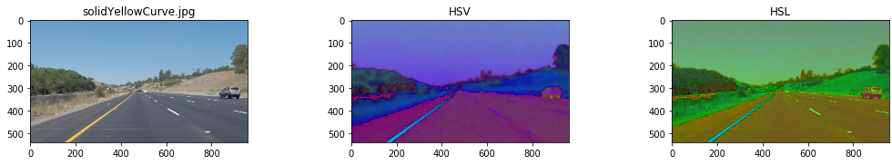
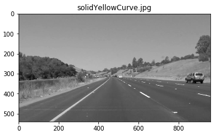
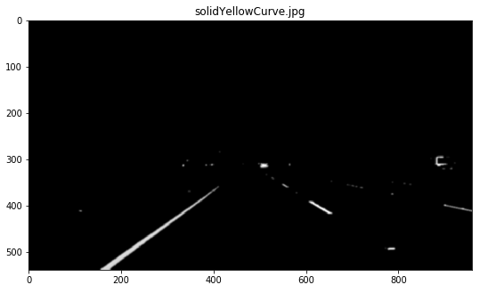
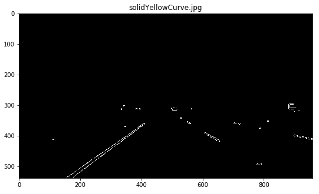
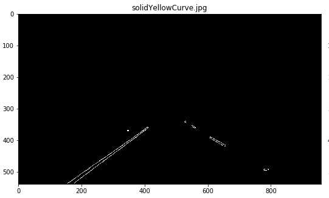
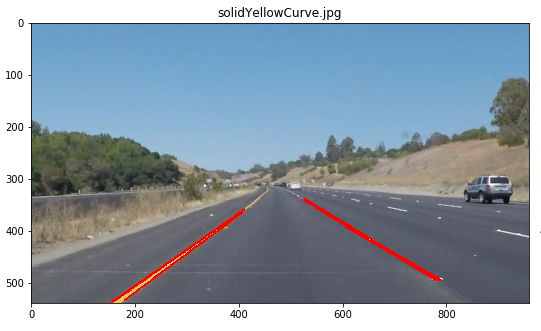
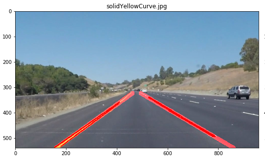

# **Finding Lane Lines on the Road** 

---

When we drive, we use our eyes to decide where to go.  The lines on the road that show us where the lanes are act as our constant reference for where to steer the vehicle.  Naturally, one of the first things we would like to do in developing a self-driving car is to automatically detect lane lines using an algorithm.

[//]: # (Image References)

[image1]: ./examples/grayscale.jpg "Grayscale"

<!-- examples/line-segments-example.jpg -->
---

## Reflection

### 1. Project Pipeline

My pipeline consisted of many steps statring from indentfy HSL color selection and end with ? as below:

<ul>
    <li>Convert our original image to HSL and HSV</li>
    <li>Isolate yellow and white from HSL image</li>
    <li>Bit-wise OR yellow and white masks to get common mask</li>
    <li>Bit-wise AND mask with original image</li>
    <li>Convert image to grayscale</li>
    <li>Apply Gaussian Blur to smoothen edges</li>
    <li>Apply Canny Edge Detection on smoothed gray image</li>
    <li>Performe Region Of Interest to remove extra data outside our poly. mask(ROI)</li>
    <li>Perform a Hough Transform to find lanes</li>
    <li>Separate left and right lanes</li>
    <li>Find the verage and the xtrapolating lane lines to create two smooth lines</li>
</ul>

First, I converted the original images to HSL and HSV images to find the white and yellow lane lines, then I converted the images to gray scale to be able to manipulate them for the next stage.

In order to draw a single line on the left and right lanes, I modified the draw_lines() function by tunes the parameters that related to all the proces until hough algorthim. I modified draw_lines function accordingly and tried to re-running my pipeline many times until I got a good results. The new output draw a single, solid line over the left lane line and a single, solid line over the right lane line. The lines start from the bottom of the image and extend out to the top of the region of interest

Below you could see how my pipeline manupilated the images from start to end;

1- Convert original image to HSL and HSV

2- Convert image to grayscale

3- Apply Gaussian Blur to smoothen edges

4- Apply Canny Edge Detection on smoothed gray image

5- Find region of Interest

6- Perform a Hough Transform

7- Create two smooth lines

### 2. Potential shortcomings with the current pipeline

One potential shortcoming would be what would happen when video exposed a couple flaws with my pipeline. this challenge requires hard coded regions, highly sensitive to color, and highly dependent on lane location.

Another shortcoming could be dealing with the parameter in all to adjected the color selection for the image.

### 3. Possible improvements to the pipeline

A possible improvement would be to better tuned hough transform and edge detection.

Another potential improvement could be to calculate region and color mask range should be done automatically not manual. 
